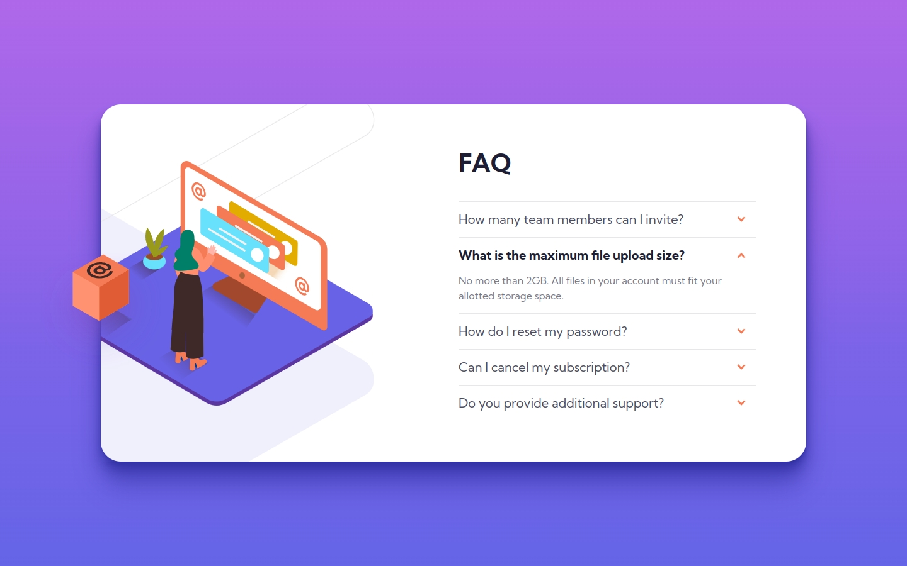
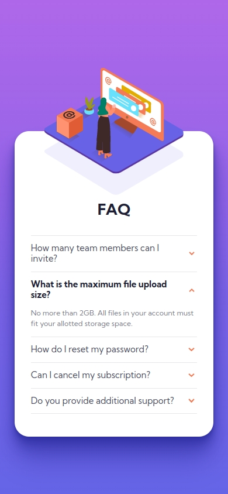

# Frontend Mentor - FAQ accordion card solution

This is a solution to the [FAQ accordion card challenge on Frontend Mentor](https://www.frontendmentor.io/challenges/faq-accordion-card-XlyjD0Oam). Frontend Mentor challenges help you improve your coding skills by building realistic projects.

## Table of contents

- [Overview](#overview)
  - [The challenge](#the-challenge)
  - [Screenshot](#screenshot)
  - [Links](#links)
- [My process](#my-process)
  - [Built with](#built-with)
  - [What I learned](#what-i-learned)
  - [Continued development](#continued-development)
  - [Useful resources](#useful-resources)
- [Author](#author)

## Overview

### The challenge

Users should be able to:

- [x] View the optimal layout for the component depending on their device's screen size
- [x] See hover states for all interactive elements on the page
- [x] Hide/Show the answer to a question when the question is clicked

### Screenshot

### Links

- Solution URL: [https://www.frontendmentor.io/solutions/faq-accordion-card-ft-11ty-cube-css-postcss-and-vanilla-js-uiDvNLNLgM](https://www.frontendmentor.io/solutions/faq-accordion-card-ft-11ty-cube-css-postcss-and-vanilla-js-uiDvNLNLgM)
- Live Site URL: [https://joshjavier.github.io/faq-accordion-card/](https://joshjavier.github.io/faq-accordion-card/)

## My process

### Built with

- Semantic HTML5 markup
- CSS custom properties
- [Utopia](https://utopia.fyi/) fluid type and space scales
- Flexbox
- CSS Grid
- [11ty](https://www.11ty.dev/)
- [PostCSS](https://postcss.org/)
- Mobile-first workflow
- Progressive enhancement

### What I learned

- `::before` and `::after` doesn't work on `img` tags.

- **Try to place `overflow: hidden` as low in the hierarchy as possible.** That way you can override it if you want specific elements to "rise above" the container.

  Case in point: the floating box on the left edge of the card on desktop view. At first, I couldn't get it to pop out of the card because the image (in this case, a pseudo-element) is anchored to the `.faq` container, where the `overflow: hidden` is also set.

  

  The solution: either change the anchor (element with `position: relative`) or move the `overflow: hidden` property so that a) they're not the same element, and
  b) the element with `overflow: hidden` is a _descendant_ of the anchor.

  Inside the `.faq` card, I have a `.faq-image` container which is the parent of the image, so I moved `overflow: hidden` there. The image has `position: absolute`, so it looks for the closest positioned ancestor, which is `.faq`, to be its anchor. Now, it can reach beyond the grasp of its over(flow)lord and break free from its box. Might be a bit too dramatic, but that's how you get hard concepts to stick. ;)

  

- Establish simple design axioms (like [measure](<https://en.wikipedia.org/wiki/Measure_(typography)>)) to make your output more consistent.

### Continued development

- Learn about web components and 11ty's WebC
- Learn Tailwind and how to use it to incorporate design tokens efficiently

### Useful resources

- [Accordion | U.S. Web Design System (USWDS)](https://designsystem.digital.gov/components/accordion/)
- [The details and summary elements | scottohara.me](https://www.scottohara.me/blog/2018/09/03/details-and-summary.html)
- [Accessible ARIA Accordions | scottohara.me](https://www.scottohara.me/blog/2017/10/25/accordion-release.html)
- [Accordion Pattern (Sections With Show/Hide Functionality)](https://www.w3.org/WAI/ARIA/apg/patterns/accordion/)
- [Accessible accordions part 2 - using &lt;details&gt; and &lt;summary&gt; - Hassell Inclusion](https://www.hassellinclusion.com/blog/accessible-accordions-part-2-using-details-summary/)
- [Equal Columns With Flexbox: It’s More Complicated Than You Might Think](https://css-tricks.com/equal-columns-with-flexbox-its-more-complicated-than-you-might-think/)
- [CSS Transform centering](https://www.30secondsofcode.org/css/s/transform-centering/)

## Author

- Website - [Josh Javier](https://joshjavier.com/)
- Frontend Mentor - [@joshjavier](https://www.frontendmentor.io/profile/joshjavier)
- Twitter - [@joshjavierr](https://twitter.com/joshjavierr)
- LinkedIn - [@joshjavier](https://ph.linkedin.com/in/joshjavier)
